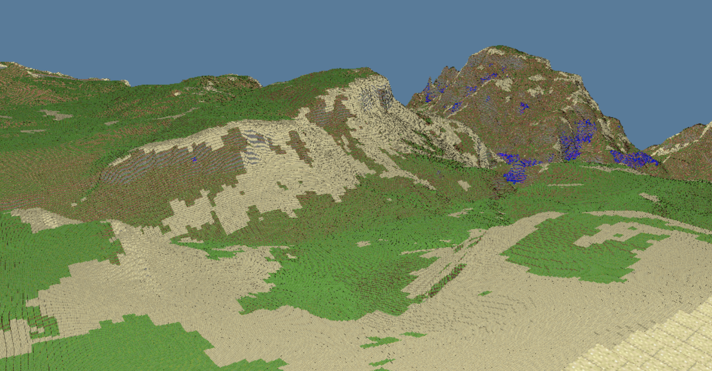
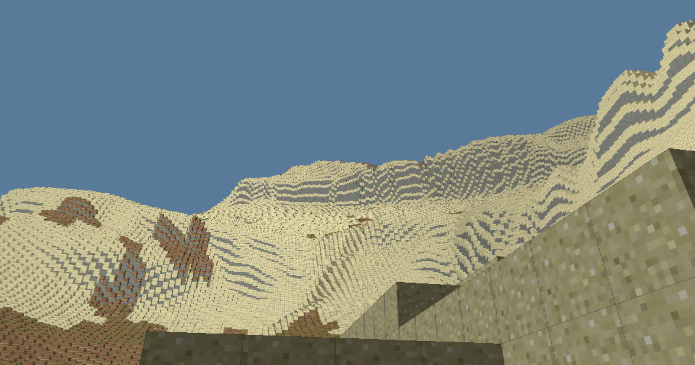

# Voxel-Earth

A multiplayer voxel game where the real Earth is the world
It uses real-world elevation and land-cover data to generate a voxel representation of Earth

Built using [VoxelVGl](https://github.com/I-had-a-bad-idea/VoxelVGL).




> World-Volume of ~5.4 * 10^10 blocks rendered at around 60FPS on an integrated GPU (may look smaller, as the the unprecise elevation data leads to more blocks using up one height)
> Grand canyon around lat. 36.1068 and lon. -112.1129

## Overview
- [Voxel-Earth](#voxel-earth)
  - [Overview](#overview)
  - [Idea](#idea)
  - [Compilation](#compilation)
    - [Building curl (once)](#building-curl-once)
    - [Building libtiff (once)](#building-libtiff-once)
    - [Compiling the actual project](#compiling-the-actual-project)
  - [Running](#running)
  - [Project status](#project-status)
    - [Problems](#problems)
  - [Licenses](#licenses)
    - [World data](#world-data)
      - [Elevation data](#elevation-data)
      - [World cover data](#world-cover-data)

## Idea
Most voxel games have a world that is either procedurally generated or hand-crafted. This project aims to create a voxel game where the world is based on real-world data. The goal is to provide a program where players can explore a voxel representation of the Earth in 1:1 scale, with the ability to modify the world and see those changes reflected in real-time for other players.


## Compilation
### Building curl (once)

Configuring curl build:

```bash
cmake -S external/curl -B external/curl/build ^
    -G "MinGW Makefiles" ^
    -DCMAKE_BUILD_TYPE=Release ^
    -DBUILD_SHARED_LIBS=ON ^
    -DBUILD_CURL_EXE=OFF ^
    -DBUILD_TESTING=OFF ^
    -DCURL_USE_SCHANNEL=ON ^
    -DCURL_USE_OPENSSL=OFF ^
    -DCURL_ZLIB=OFF ^
    -DCURL_BROTLI=OFF ^
    -DCURL_ZSTD=OFF ^
    -DCURL_USE_LIBPSL=OFF ^
    -DUSE_NGHTTP2=OFF ^
    -DUSE_NGHTTP3=OFF ^
    -DUSE_IDN2=OFF
```

Building curl:

```bash
cmake --build external/curl/build --config Release
```

Find where CMake put the built curl and edit the Makefile accrodingly (replace the `-L$(CURL_DIR)/build/lib` with whatever you need)
Seems like you also have to put the `libcurl.dll` file next to the executable.

### Building libtiff (once)

Configuring libtiff build:

```bash
cmake -S external/libtiff -B external/libtiff/build
    -G "MinGW Makefiles"
    -DCMAKE_BUILD_TYPE=Release
    -DBUILD_SHARED_LIBS=ON
    -Dtiff-tools=OFF
    -Dtiff-tests=OFF
    -Dtiff-contrib=OFF
    -Dtiff-docs=OFF
    -Dtiff-install=OFF
```

Building libtiff:

```bash
cmake --build external/libtiff/build --config Release
```

### Compiling the actual project

Run:

```bash
make
```

You will have a `client.exe` and a `server.exe`.


## Running

1. [Compile the project](#compilation)
2. Execute the `server.exe` and keep it open
3. Execute the `client.exe`
4. Tell your friend to execute the `client.exe`
5. (See that he cant connect because currently servers are only locally)
6. End client/server with `Esc` (never just close the server or you might lose the changes made to the world)

## Licenses

### World data
All data is downloaded in real time.

#### Elevation data
The elevation data is from a dataset managed by Mapzen:
https://registry.opendata.aws/terrain-tiles/            
[Terrain Tiles Atttribution](./TERRAIN_TILES_ATTRIBUTION.md)

#### World cover data

The world cover data is from a dataset by the European Space Agency (ESA):
https://esa-worldcover.org/en           
*© ESA WorldCover project 2021 / Contains modified Copernicus Sentinel data (2021) processed by ESA WorldCover consortium*          
> The ESA WorldCover product is provided free of charge, without restriction of use. For the full license information see the Creative Commons Attribution 4.0 International License.